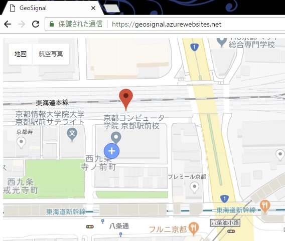

# GeoSignal
位置情報を共有して地図上に表示するブラウザーアプリです。  
A browser app that shows shared positions on the map.

dummy.html を表示しておくと、東に移動し続ける人をシミュレートできます。

## Development Environment
- .NET Framework 4.5
- ASP.NET SignalR 2.2.3
- Google Maps JavaScript API

### Records
2018.06.21-29 京都コンピュータ学院 未来環境ラボ 「Re:京都オープンデータハッカソン」
